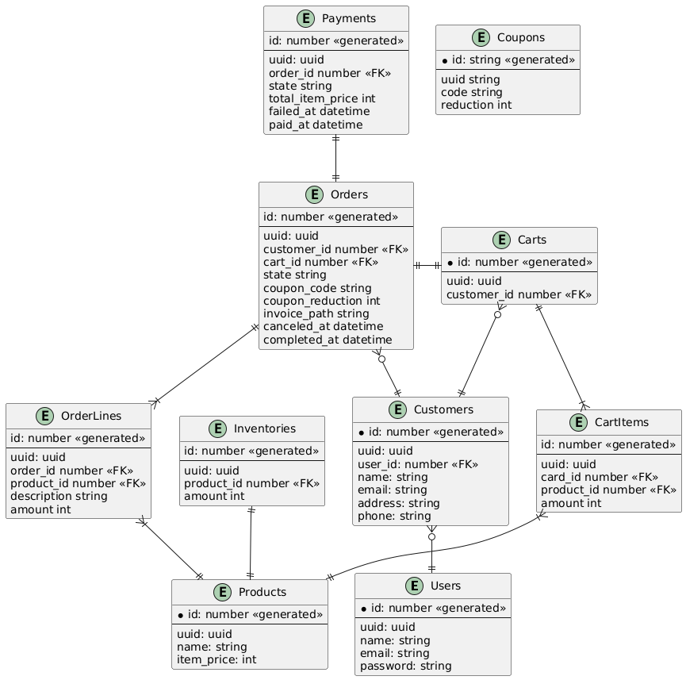

# 🛒 ShoppingCart Application - Clean Architecture and Domain Event Driven

## 📝 Description

This project is a simple application focused on e-commerce domain. It demonstrates how I implemented clean architecture combined with domain event driven design.

## 🗂️ Detail

### 🧩 Functional requirement

- The project has 2 actors: **admin** and **customer**.
- Customers and Admins can login with email and password.
- Customers can view the product list.
- Customers can add products to their cart.
- Customers can place orders with the selected items in their cart.
- Customers can enter a coupon code when placing an order.
- Customers can process payment.
- Customers can see the invoice pdf after payment.
- Customers can check their order histories.
- Admins can view customers who have visited website or placed an order.
- Admins can manage products.
- Admins can manage orders.
- Admins can view invoices pdf of orders.
- Admins can mange coupons.

### 🔍 Analyze requirement

#### 🔐 Authentication

Authentication is implemented using JWT, as it provides a simple integration and reliably supports user login with email and password.

#### 🧱 Database design

#### 🗺️ Diagram design

