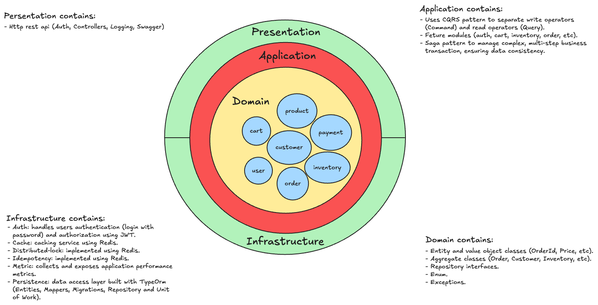

# Nestjs Shopping Cart - Clean Architecture

This project is a personal shopping cart web application. It is inspired by concepts explored in [Event Sourcing in Laravel](https://event-sourcing-laravel.com/) by **SPATIE**. It is my attempt to create a clean architecture based application in nestjs.



## 1. Core Architecture & Design Pattern

- **Clean architecture:** The application is strictly layered to ensure separation of concerns, testability, and independence from external frameworks and infrastructure.
  - **Domain layer:** Container core business logic, aggregates, and value objects, with zero external dependencies.
  - **Application Layer:** Orchestrates use cases, commands, and sagas. Defines interfaces(ports) for external dependencies.
  - **Infrastructure Layer:** Provides concrete implementations (adapters) for persistence, caching, and further payment gateways.
  - **Presentation layer:** Exposes the application to the outside world via REST APIs.
- **Domain-Driven Design (DDD):** Employs DDD principles to model a complex business domain.
  - **Aggregate:**: Enforces business rules and data consistency within transactional boundaries like the `OrderAggregate`. All state changes for an order are managed through this single root, ensuring validity.
  - **Value Objects:** Ensures correctness and encapsulates business rules with objects like `Price`, `OrderId`, and `SagaId`.
- **Command Query Responsibility Segregation (CQRS):** Leverages the `@nestjs/cqrs` module to separate read (Query) and write (Command) operations, leading to a clearer and more scalable application flow.
- **Saga Pattern (Orchestration):** Implements the Saga pattern to manage distributed transactions that span multiple domains (Order, Inventory, Payment), ensuring the entire process either completes successfully or is fully compensated.
- **State Pattern:** The `OrderAggregate` uses the State Pattern to manage its lifecycle (`Pending`, `Completed`, `AwaitingPayment`, `Failed`, `Canceled`), encapsulating state-specific logic and transitions.

## 2. Key Feature & Business Logic

- **End-to-End Order Processing Saga:** A complete, orchestrated saga handles the entire order lifecycle:
  - **Order Creation:** Creates the order record atomically with the saga initiation.
  - **Inventory Reservation:** Checks for and reserves stock before processing payment.
  - **Payment Processing:** Initialize payment after deducting stock from inventory.
  - **Order Completion:** Marks the order as complete after successful payment.
- **Idempotent Rest API:**
  - The `POST \orders` endpoint (and other critical write endpoints) are idempotent.
  - Uses an `Idempotency-Key` header and a customer Nestjs interceptor with a Redis backend to prevent duplication orders or payments from client retries.
- **Distributed lock:**
  - Implement a distributed locking mechanism using Redis to prevent race conditions in high-contention scenarios.
  - This is crucial for operations like inventory reservation, ensuring that if two concurrent requests try to claim the last item, only one will succeed, thus preventing overselling and maintaining data integrity.
- **Resilience & Fault Tolerance**
  - **Stateful Saga Persistence:**
    - Uses a `SagaInstance` entity and repository to durably persist the state(`currentStep`, `payload`) of every single order process.
    - This provides a complete audit trail and is the foundation for crash recovery.
  - **Automated Crash Recovery:**
    - A `SagaRecoveryService` runs on application startup (`OnApplicationBootstrap`).
    - It automatically finds any sagas that were interrupted by a server crash or deployment and resumes them from their last successfully completed step, ensuring data consistency.
  - **Compensation Transactions (Rollbacks):**
    - If any step in saga fails (e.g., payment processing), the orchestrator automatically triggers compensation actions in reverse order.
    - This includes canceling the order record, and releasing reserved inventory, ensuring the system  returns to a consistent state.

## 3. Demo

### 3.1 API


### 3.2 Monitoring

#### 3.2.1 Application Monitoring


#### 3.2.2 Postgres Database Monitoring


#### 3.2.3 Redis Cache Monitoring


## 4. Structure Overview

```
/core/domain
├── order                               # Bounded Context for all Order-related business logic.
│   ├── aggregate                       # Contains the OrderAggregate root, the guardian of order consistency.
│   ├── entity                          # Domain entities that are part of an aggregate.
│   ├── enum                            # Domain-specific enumerations.
│   ├── event                           # Domain Events (e.g., OrderCreatedEvent)
│   ├── exception                       # Custom exceptions for business rule violations.
│   ├── mapper                          # Mappers for converting between domain object and other representation.
│   ├── repository                      # Interfaces for persistence.
│   ├── state                           # Implementations for the State Pattern.
│   └── value-object                    # Immutable objects representing domain concepts.
├── ...                                 # Other Bounded Contexts like Product, Inventory, Payment, etc.
├── port                                # Domain-level ports
│   └── unit-of-work.interface.ts       # Interface for managing atomic operations across multiple repositories.
├── saga                                # Domain representation for the Saga process itself
│   ├── entity                          # The SagaInstanceEntity, representing the persisted state of a saga.
│   ├── enum                            # Enumerations for saga steps and statues.
│   ├── interface                       # Interfaces related to the saga domain model.
│   ├── repository                      # The ISagaInstanceRepository interface.
│   └── value-object                    # Value object like SagaId.
└── shared                              # Core shared across different domain.
    ├──domain                           # Base classes like BaseAggregateRoot or shared value objects.
    └──types                            # Shared types and interfaces.
```

```
/core/application
├── application.module.ts               # Aggregate all application-layer modules.
├── auth                                # Application logic for authentication.
│   ├── application-auth.module.ts      # NestJs module for auth-related application services.
│   ├── command                         # Commands and handlers for auth actions (e.g., LoginCommand).
│   └── dto                             # Data transfer object used within auth application services.
├── cart                                # Application logic for shopping cart
│   ├── application-cart.module.ts      # NestJs module for cart-related application services.
│   ├── command                         # Commands and handlers for cart actions.
│   ├── dto                             # Data transfer object
│   ├── mapper                          # Mapper for mapping object logic and dto 
│   └── query                           # Queries and handlers for fetching cart data.
├── inventory                           # Application logic for inventory
│   ├── application-inventory.module.ts # NestJs module for inventory-related application services.
│   ├── command                         # Commands and handlers for inventory actions.
│   └── event                           # Events published by actions.
├── order                               # Application logic for order
│   ├── application-order.module.ts     # Nestjs module for order-related application services.
│   ├── command                         # Commands and handlers for order actions.
│   ├── dto                             # Data transfer object.
│   ├── mapper                          # Mapper for mapping between domain object and dto.
│   └── query                           # Queries and handlers for fetching order data.
├── payment                             # Application logic for payment
│   ├── application-payment.module.ts   # NestJs module for payment-related application services.
│   └── command                         # Commands and handlers for payment actions.
├── port                                # Interfaces defining contracts for infrastructure layer.
│   ├── cache.interface.ts              # Contract for caching service.
│   ├── distributed-lock.interface.ts   # Contract for distributed locking mechanism.
│   ├── hashing.service.ts              # Contract for a password hashing service.
│   ├── idempotency.interface.ts        # Contract for handling idempotent requests.
│   ├── payment.gateway.ts              # Contract for an external payment gateway
│   └── token.service.ts                # Contract for generating and validating JWTs.
├── product                             # Application logic for product
│   ├── application-product.module.ts   # Nestjs module for product-related application services.
│   ├── dto                             # Data transfer object.
│   ├── mapper                          # Mapper for mapping between domain object and dto.
│   └── query                           # Queries and handlers for fetching product data.
└── saga                               # Logic for managing and recovering saga processes
    ├── application-saga.module.ts     # Nestjs module for saga-related services.
    ├── orchestrator                   # The SagaOrchestrator classes that drive the saga flow.
    └── recover                        # The SagaRecoverService for handling crash consistency.
```

```
/infrastructure
├── auth                                    # Implementation for authentication.
│   ├── auth.module.ts                      # Provides and configures auth services, strategies, and guards
│   ├── guards                              # NestJs Guards (e.g., JwtAuthGuard, RolesGuard).
│   ├── services                            # Services(e.g., JwtTokenService implementing ITokenService)
│   └── strategies                          # Passport.js strategies (e.g., LocalStrategy, JwtStrategy).
├── cache                                   # Implementation for caching
│   ├── cache.module.ts                     
│   └── redis-cache.service.ts              # Redis implementation of ICacheService 
├── distributed-lock
│   ├── distributed-lock.module.ts          
│   └── redis-distributed-lock.service.ts   # Redis implementation for IDistributedLockService
├── idempotency                             # Implementation for idempotency.
│   ├── idempotency.module.ts
│   ├── idempotent.decorator.ts             # A custom decorator to apply interceptor
│   ├── idempotency.interceptor.ts          # NestJs interceptor to handle idempotency keys.
│   └── redis-idempotency.service.ts        # Redis implementation for IIdempotencyService
├── infrastructure.module.ts                # Root module that aggregates all infrastructure providers.
├── metric                                  # Implementation for application monitoring and metrics (e.g., Prometheus).
│   ├── metric-security.interceptor.ts
│   ├── metric.controller.ts
│   ├── metric.interceptor.ts
│   ├── metric.module.ts
│   └── metric.service.ts
├── persistence                             # Implementation for data persistence.
│   ├── persistence.module.ts               # Configures the ORM and provides repository implementations.
│   ├── seed                                # Database seeding scripts (factories, script).
│   └── typeorm                             # TypeOrm-specific code (schema, repositories, migrations, etc)
└── redis                                   # Low-level Redis client configuration and module.
    ├── redis.constant.ts
    └── redis.module.ts
```

```
/presentation
├── presentation.module.ts                  # Root module for the presentation layer
└── rest                                    # All components related to the REST API.
    ├── auth                                # API components for the Auth resource.
    │   ├── auth.module.ts
    │   ├── controller
    │   ├── dto
    │   └── shared
    ├── cart                                # API components for the Cart resource.
    │   ├── cart.module.ts
    │   ├── controller
    │   └── dto
    ├── order                               # API components for the Order resource.
    │   ├── controller
    │   ├── dto
    │   └── order.module.ts
    ├── payment                             # API components for the Payment resource.
    │   ├── controller
    │   ├── dto
    │   └── rest-payment.module.ts
    ├── product                             # API components for the Product resource.
    │   ├── controller
    │   ├── dto
    │   └── product.module.ts
    ├── rest.module.ts                      # Aggregates all REST-related feature modules (Auth, Order, etc.).
    └── shared                              # Components shared across different REST resources.
        └── dto
```

## 5. Getting Started

### 5.1 Running the project

#### Prerequisites

Before you begin, ensure you have the following installed in your system:

- Docker: Download and install from official [Docker website](https://docker.com), Make sure Docker daemon is running.
- Docker compose: This is included in this most modern Docker installation.

#### Step 1: Start the Application Services

```
docker compose up -d
```

#### Step 2: Run Database Migration

```
docker exec -it shopping_app_server npm run migration:run
```

#### Step 3: Seed the Database

```
docker exec -it shopping_app_server npm run db:seed  
```

#### Accessing the Services

Once the setup is complete, you can access the running services at the following local addresses:

- **Api document (Swagger UI):**
  - URL: [http://localhost:3000/api-docs](http://localhost:3000/api-docs).
  - Explore and interact with the available API endpoints here.
- **Default User Account:**
  - Username: <test@example.com>
  - Password: password123
- **Monitoring Dashboard (Grafana):**
  - URL: [http://localhost:3001/dashboards](http://localhost:3001/dashboards)
  - View application metrics and performance dashboards.

#### Additional commands

Here are some useful commands for managing application environment:

- **To Stop the application services:**

  ```
  docker compose down
  ```

- **To view the log of specific service:**

  ```
  docker logs shopping_app_server -f
  ```

- **To access the specific service:**

  ```
  docker exec -it shopping_app_server sh
  ```

### 5.2 Features

#### Filtering

To do filter, we use LHS Brackets:

LHS is a way to encode operators by using square brackets `[]` on the key name.

For example:

```
curl -X 'GET' \
  'http://localhost:3000/api/v1/products?filter[price][gte]=1000' \
  -H 'accept: application/json'
```

This example indicates filtering out product which prices are greater or equals to 1000.

All supported operators:

| Operator  | Description                            |
| --------- | -------------------------------------- |
| eq        | Equals (=)                             |
| neq       | Not equals (!=)                        |
| gt        | Greater than (>)                       |
| lt        | Less than (<)                          |
| lte       | Less than or equals to                 |
| like      | LIKE (case-sensitive)                  |
| ilike     | ILIKE (case-insensitive)               |
| in        | IN (comma-separated values for arrays) |
| isNull    | IS NULL                                |
| isNotNull | IS NOT NULL                            |

I designed this filter based on <ins>[Strapi filter](https://docs.strapi.io/cms/api/rest/filters)</ins>

Here is the code to apply filter

```
this.queryBuilderService.buildQuery<ProductSchema>(
        this.ormRepository,
        { ...criteria, pagination },
        {
          alias: 'product',
          allowedFilters: ['uuid', 'name', 'price'],
          allowedSorts: ['name', 'uuid', 'createdAt'],
          defaultSort: [{ field: 'createdAt', direction: 'DESC' }],
        },
);
```

#### Pagination

This project supports both offset and cursor pagination

For example:

```
// Offset pagination

curl -X 'GET' \
  'http://localhost:3000/api/v1/products?page=1&limit=20 \
  -H 'accept: application/json'
```

```
// Result
{
  "data": [
    {
      "id": "11f54516-3d0b-4a22-95aa-8959619ba902",
      "name": "Oriental Plastic Keyboard",
      "price": "$68,935.00"
    },
    {
      "id": "16f1e226-8d17-4b03-a828-97fe8e2e9b2d",
      "name": "Unbranded Granite Keyboard",
      "price": "$507,432.00"
    },
    ...
  ],
  "total": 60,
  "page": "1",
  "limit": 20,
  "totalPages": 3
}

```

```
// Cursor pagination

curl -X 'GET' \
  'http://localhost:3000/api/v1/cart?limit=5' \
  -H 'accept: application/json'
```


```
// Result

{
  "id": "822d9e66-2d2b-4487-84a4-5718d899b45b",
  "cartItems": [
    {
      "productId": "16f1e226-8d17-4b03-a828-97fe8e2e9b2d",
      "quantity": 3,
      "unitPrice": 507432
    },
    {
      "productId": "a410451d-6cdb-4459-bc1c-ba790672e314",
      "quantity": 3,
      "unitPrice": 124345
    },
    ...
  ],
  "totalPrice": 4159788,
  "pagination": {
    "limit": "5",
    "nextCursor": "eyJ1dWlkIjoiNGE5YmM1MmMtYmFjMS00YWYwLTllMTUtNDQzZjMyNjAxNGRmIn0",
    "previousCursor": null,
    "hasNextPage": true,
    "hasPreviousPage": false
  }
}

```

#### Caching

Implemented using Redis as a cache backend.  
See: [`redis-cache.service.ts`](./server/src/infrastructure/cache/redis-cache.service.ts)

#### Distributed lock

Implemented with Redis to ensure safe concurrent operations (e.g., inventory reservation).  
See: [`redis-distributed-lock.service.ts`](./server/src/infrastructure/distributed-lock/redis-distributed-lock.service.ts)

#### API Idempotence

Implemented via a custom NestJS interceptor and Redis backend to prevent duplicate processing of requests.  
See: [`idempotency.interceptor.ts`](./server/src/infrastructure/idempotency/idempotency.interceptor.ts)

## 6. Technology Stack

- Framework: NestJS.
- Language: Typescript.
- Architecture: Clean Architecture, Domain-Driven Design
- Pattern: CQRS (`@nestjs/cqrs`), Saga (Orchestration), Repository Pattern, and Unit Of Work Pattern.
- Persistence: TypeORM.
- Database: Postgres, Redis.
- Monitoring: Grafana. Prometheus.
- API: REST.

## 7. License

This project is licensed with the [MIT license](LICENSE).
